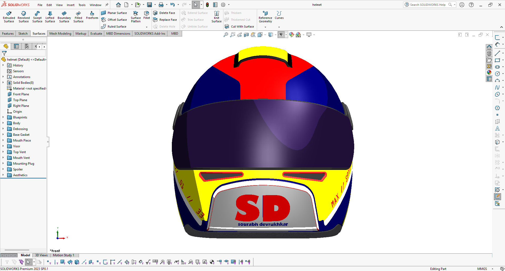
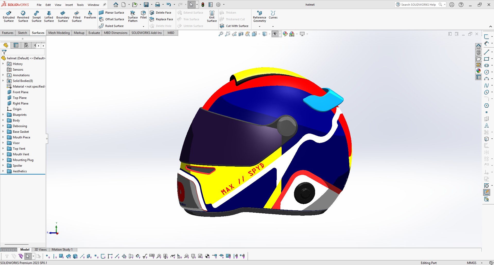
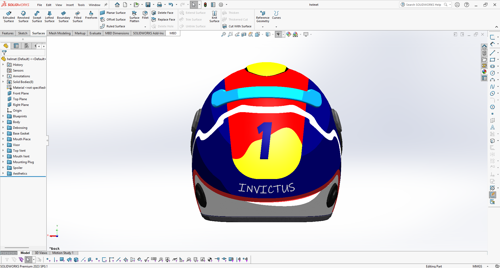
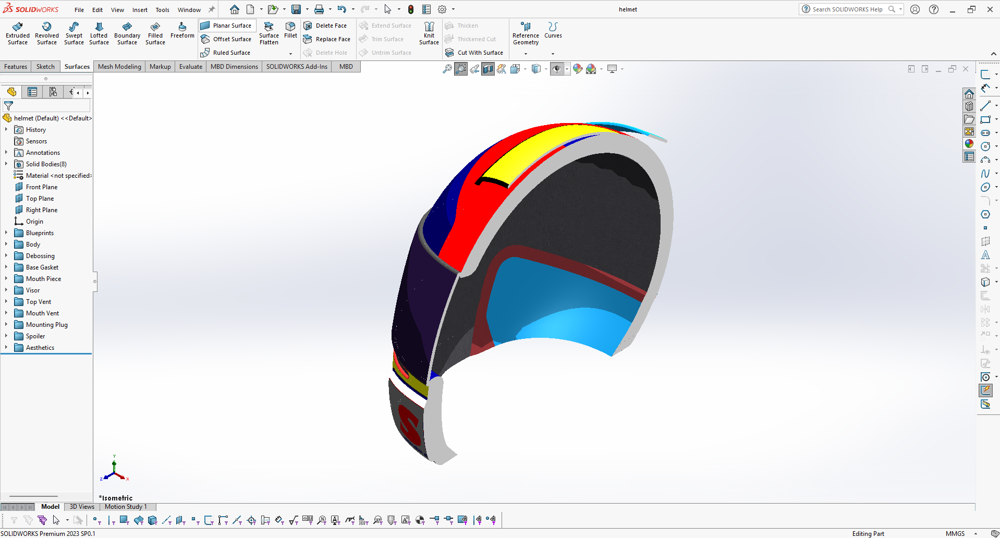

# 🏎️ Racing Helmet | SolidWorks Surfacing

This project is a detailed surface model of a racing helmet created in SolidWorks. The main focus was on getting smooth, clean surfaces while keeping the design organized and easy to modify.

---

## 🚀 What this project focuses on

The helmet is built with an emphasis on surface quality, especially maintaining G2 (curvature) continuity across transitions. A top-down approach was used to keep everything structured and manageable as the model got more complex.

---

## 🛠️ Design Highlights

- **Advanced Surfacing**  
  Built using tools like Boundary Surfaces, Lofted Surfaces, and Surface Knit to shape the helmet smoothly.

- **Clean Organization**  
  The model is split into 10+ folders to keep features easy to navigate and edit.

- **Top-Down Design**  
  Multiple solid bodies (around 8) are managed within a single master part for better control.

- **Custom Details**  
  Includes "SD" branding created using Split Line and Offset Surface features.

---

## 🖼️ Gallery

    
    

---

## Notes

This project is mainly about practicing surface modeling techniques in SolidWorks. It’s a good example of handling complex shapes while keeping the workflow organized.
